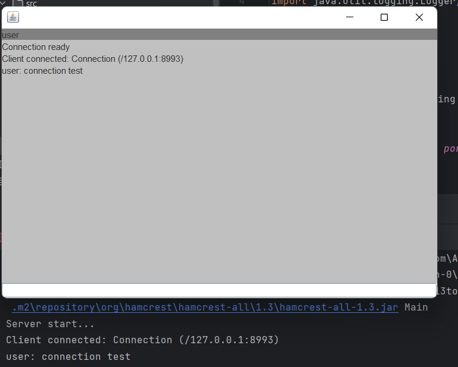

#  **Networkchat**.
## *Многопоточный сетевой чат*
### Модули:

- server - серверная часть чата с возможностью подключения клиентов через порт из файла настроек (Setting.txt).
- client - клиентская часть чата с интерфейсом на базе библиотеки java swing. Настройки для подключения получает из файла Setting.txt. Выход из чата происходит после ввода “/exit”.
- connection - содержит класс для связи серверной и клиентской части и интерфейс реализуемый этими модулями. Так же содержит класс для получения настроек соединения из файла Setting.txt.

telnet connection test:

client connection test:

